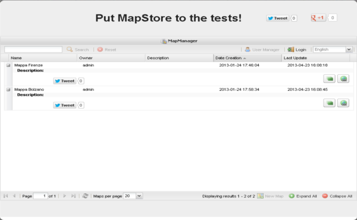

.. module:: mapstore.mapmanager
   :synopsis: Learn on how to use The MapManager.

.. _mapstore.mapmanager:

Using the MapManager
====================

This section illustrates how you can use the MapManager.

MapManager Overview
^^^^^^^^^^^^^^^^^^^

MapManager, using a single interface, allow the user to create, delete and search maps, generate an embed link to put a Map in a web site, share your own maps with other users. This is performed interacting with GeoStore. MapManager supports both authentication and definition of access policies to protect maps managed by GeoStore.

**Resources** (maps created by users) are displayed in a grid that describes content by using the following attributes:

* `Name`: Name assigned by the user to the resource
* `Owner`: Owner of the resource
* `Description`: Description assigned by the user to the resource
* `Date Creation`: Creation date of the resource
* `Last Update`: Last update of the resource

			MapManager Overview.

.. warning:: In order to use MapStore with the MapManager, the `GeoStore <https://github.com/geosolutions-it/geostore>`__ component is required as Map storage level. GeoStore provides also an authentication/authorization level that allows the MapManager to manage Users and Roles.

1. Open the `MapManager <http://localhost:8081/mapstore>`__.

2. Select your language througth the dropdown on top-right side of the main panel:

	.. figure:: img/mapmanager-lang.png

3. Click on the login button on top-right side of the main panel and enter **admin** as *User* and **admin** as *Paswword*: 

	.. figure:: img/mapmanager-login.png
				
				Login Button.
				
	.. figure:: img/login.png
	
				Login Form.
	
4. After the login the MapManager functionalities will be enabled, so you can manage maps:

	.. figure:: img/mapmanager-all.png
	
				MapManager after the Login.

	.. note:: MapManager enabled functionalities depends by the Role of the User logged. According to the current policies of MapStore:

			* The Admin can do everithing on all maps 
			* The User can edit his maps and only view the maps of the other users

MapManager functionalities
^^^^^^^^^^^^^^^^^^^^^^^^^^

Search and manage Maps
----------------------

1. Search your Map using the Search tool on the top-left side of the panel. Enter **Counties** in the text field:

	.. figure:: img/searchtool.png
	
				Search Tool.
				
	.. note:: The search is *case insensitive* and is performed on the Map name. The User can enter a partial string.
	
2. Clicking on the '+' icon beside the Row, expand the Grid row in order to show the available operations on this Map:

	.. figure:: img/gridrow.png
	   :width: 600
		
	   Availables funtionalities on selected Map.

   The available operation for the Admin user are :
   
   * **Facebook Share**: The user can share existing map on Facebook.
   
   * **Twitter Share**: The user can share existing map on Twitter.
   
   * **Edit Info**: Allows to edit Map metadata 
   
		.. figure:: img/mapinfo.png
		
					Metadata Edit
		
   * **Delete Map**: Allows the user to delete the selected Map from teh database. A message box appeasr in order to confirm the operation.
   
   * **Edit Map**: Open the Map in Edit mode. So you can modify his configuration for exaple adding new layers, WMS sources, modifying the extent and more.
   
   * **View Map**: Open the Map in View mode. In this case the User can only navigate the Map, add new layers and WMS sources but without saving.
   
   * **Embed Map**: A dialog allows the User to configure an HTML iframe component providing a way to publish the existing Map in his in a web site.
   
		.. figure:: img/embed.png
		
					Embed Map
	
   * **Clone Map**: Makes a copy of the existing Map in the database. A new row appears inside the grid in order to show the new created Map (the copy).

3. Click on the **Reset** button placed beside the Search tool (on the right).

4. The Map's list is paginated. So the User can navigate Maps changing the current page and choosing how many Maps per page. By default the User can navigate 20 Maps per page but he can chose between: 10, 20, 50, 100.

		.. figure:: img/pagingtoolbar.png
		
					Paging Toolbar
					
   .. note:: The rows in the list can be all expanded or collapsed using specific controls in the bottom-left side of the MapManager panel (``Paging Toolbar``):
		
		.. figure:: img/expand-collapse.png
		
5. Create a new empty Map from the MapManager clicking on the *New Map* button placed on the ``Paging Toolbar``:

		.. figure:: img/newmap.png
		
					New Map
					
A new Window will be open in **Edit** mode with an empty Google background. Now the User is able to create his Map.

	.. figure:: img/emptymap.png
	
				An Emptry Map

6. Click on the **Save** button on the Map Toolbar in order to save the Map. Specify the **Map Metadata**, enter **training-map** as ``Name`` and what do you want as ``Description`` (for example **This is the Map of the Training**).

		.. figure:: img/saveemptymap.png
		
					Save the empty Map from the Map Composer
					
7. Click on **Add Map** in order to Save. Then close the Map Window clicking on the 'X' button on the right corner. The newly created map will be showed in the Map's list.

		.. figure:: img/upgrid.png
		
					The updated grid.

.. note:: **Next sections will you explain how to use the MapComposer functionalities**.
					
Manage Users
------------

The MapManager allows the Admin to manage Users. So the Admin can:

* **Navigate** the list of the Users: Using a Search Tool (the same as described before) and the Paging Toolbar (the list of the user is paginated).

* **Modify** an User Account.

* **Delete** an User.

* **Create** a new User.

1. Click on the **User Manager** button besides the *Login* button in order to open tha User Manager dialog:

		.. figure:: img/usermanager.png
		
					User Manager.
 
2. Modify the User named **User** clicking on the ``Edit`` icon in the User Grid row:

		.. figure:: img/modifyuser1.png
		
					Open the Modify User Dialog.

		.. figure:: img/modifyuser2.png
		
					Modify the User.
					
3. Change the **User** password entering ``user`` as new password and then click ``Save``.

4. Now click on **Create new User** button located in the main top Toolbar in order to create a new User:

		.. figure:: img/newuser.png
		
					Create a new User.

5. Enter:

	- Name: **training**
	- Password: **training**
	- Role: **USER**
	
Then click ``Save`` and the newly created User will be shown on the Grid:
	
		.. figure:: img/newusergrid.png
	
				The updated User List.
	
6. Close the MapManager and login as the new User **training**. After this, expand the ``training-map`` Row. As you can see, with this User, is not possible to modify or delete this Map.

		.. figure:: img/trainingrow.png
	
				The training-map row in the grid with the newly User.
				
7. Logout as **training** User and still log in as Admin.