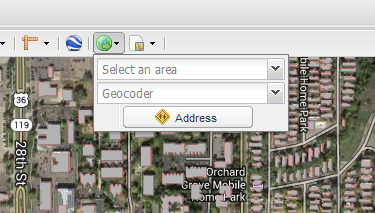
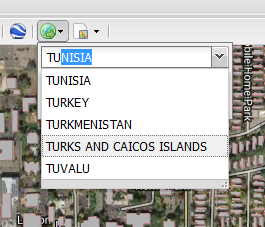
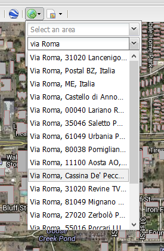
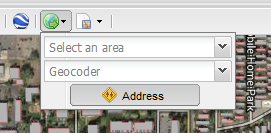
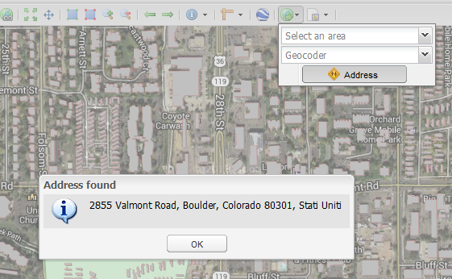

.. _mapstore.geolocation:

Using the GeoLocation Menu
==========================

The GeoLocation Menu |geolocicon| provides three different services for map navigation:

* A list of configurable locations
* A Geocoder to search for an address location
* A Reverse Geocoder to get the address from a location

Jump to a selected location
^^^^^^^^^^^^^^^^^^^^^^^^^^^

| The first dropdown of the tool holds a static list of locations
| Selecting one of them will make the map to center on that location

Jump to a specific address
^^^^^^^^^^^^^^^^^^^^^^^^^^

| The second textbox is the Geocoder, it allows the searching of an address
| Selecting an address from the results will make the map to center on that location

Get the address of a point on the map
^^^^^^^^^^^^^^^^^^^^^^^^^^^^^^^^^^^^^

| The `Address` button enable a tool to choose a point on the map
| After clicking on the map a popup will appear, showing the address of the selected position

			The tool is called `Reverse Geocoder`

			The address accuracy depends on the background map selected

