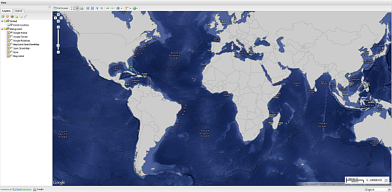
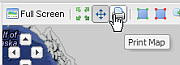
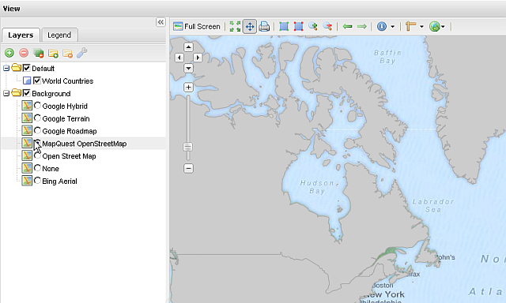
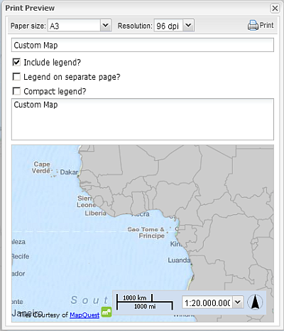
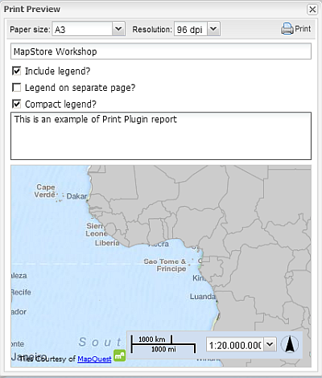
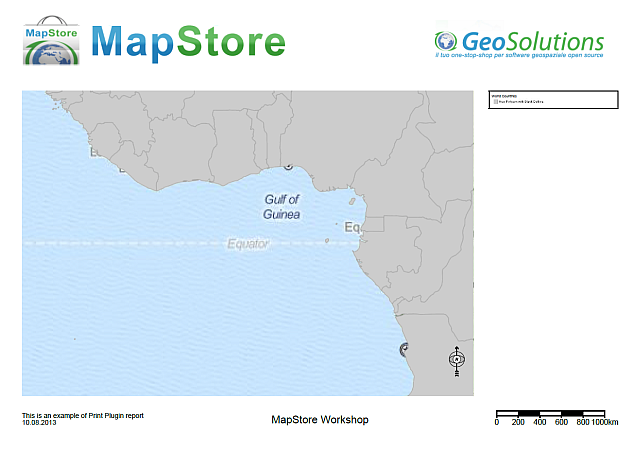
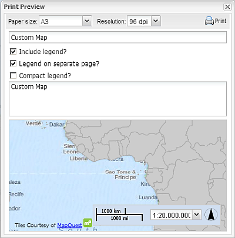
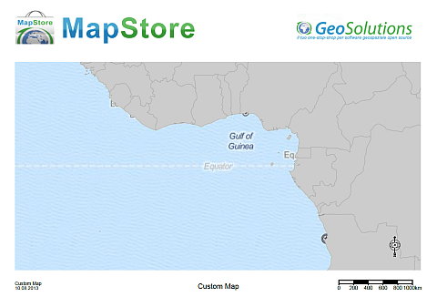
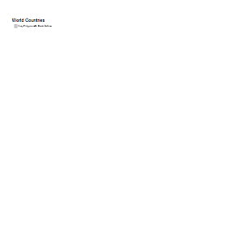

.. module:: mapstore.printplugin
   :synopsis: Learn on how to use The Print Plugin.

.. _mapstore.plugins.printplugin:

Using the Print Plugin
======================

This section illustrates how you can use the Print Plugin. 
The Print Plugin allows a user to create a nice and printer-friendly PDF of the current map and legend.

The MapStore Print Plugin needs some server side components deployed on GeoServer:

   #. The `GeoServer Print Plugin <http://docs.geoserver.org/stable/en/user/community/printing/>`__ based on `MapFish Print <http://www.mapfish.org/doc/print/>`__
   #. `YAML <http://yaml.org/>`__, a human friendly data serialization standard for all programming languages.

Printing a Map
^^^^^^^^^^^^^^

1. Open the `MapComposer <http://localhost:8081/mapcomposer/?locale=en&config=printConfig>`__. 

    
   MapComposer with Print Plugin.

.. note:: This Print configuration provides a ``World Countries`` layer overlay and several base layers which will be used to generate several kind of reports as examples.

2. Search for the *Print* button on the Top ToolBar

    
   MapComposer Print button.

3. Trying to click on the button with this default layout will send al *alert*

.. figure:: img/printing3.png
   :align: center
    
   MapComposer Print button error.

.. warning:: The Google base maps cannot be printed with this *Print Plugin* due to licensing issues.

4. Select another **non** Google background from the *Layers* tree panel; as an instance the *MapQuest OpenStreetMap* one.

    
   MapQuest OpenStreetMap background selected.

5. Click again on the *Print* button; a *Print Preview* dialog window should pop-up on the center of the map

    
   MapComposer Print Preview dialog window.

6. As you may notice the dialog window shows several options. It is possible to change the *Paper size*, the DPI *Resolution*.
   
   Try few examples:
   
    * Change the *Title* of the map to **MapStore Workshop** and the *Abstract* to **This is an example of Print Plugin report** as depicted below
      
      .. figure:: img/printing6.png

    * Click on the *Print* button of the *Preview Window* dialog; you should be able to get a PDF similar to the one depicted below
    
      .. figure:: img/printing7.png

7. As you can see in the previows example, the text of the legend is bigger than the available width. In order to avoid this, repeat the previows steps by enabling the **Compact legend** checkbox

    
   Compact Legend checkbox.

8. Click on the *Print* button of the *Preview Window* dialog; you should be able to get a PDF similar to the one depicted below

    
   Compact Legend example.

.. note:: Notice how the legend width is now adapted to the column.

9. If it is not enough, this example configuration allows also to print the legend on a new page.

    
   Legend on a separate page checkbox.

    

   Legend on a separate page example.

.. warning:: The available layouts are not hardcoded on MapStore or fixed. They depend exclusively from the *YAML* config of the GeoServer Print Plugin, which is explained a bit deepter in the next section.

Customizing a Report
^^^^^^^^^^^^^^^^^^^^

As stated before, the *Print Plugin* relies into a **YAML** configuration file.

YAML (rhymes with "camel") is a human-friendly, cross language, Unicode based data serialization language designed around the common native data types of agile programming languages. It is broadly useful for programming needs ranging from configuration files to Internet messaging to object persistence to data auditing. Together with the Unicode standard for characters, this specification provides all the information necessary to understand YAML Version 1.2 and to create programs that process YAML information.

The Print Plugin configuration file is located into the folder

:file:`$TRAINING_ROOT/geoserver_data/printing/config.yaml`

.. note:: Every time this file is modified, you have to refresh the MapStore browser page. MapStore reads the GeoServer Printing plugin configuration at startup, and therefore the internal MapStore Print module is initialized accordingly to the *config.yaml*.

.. warning:: You **do not** need to restart GeoServer nor any Tomcat instance, but **just** refresh the browser page.

**References**

* The *YAML* specification and more detailed documentation can be found here `YAML Ain t Markup Language (YAML) Version 1.2 <http://www.yaml.org/spec/1.2/spec.html>`__ (http://www.yaml.org/spec/1.2/spec.html)

* The detailed *MapFish Print* configuration documentation can be found here `Configuration <http://www.mapfish.org/doc/print/configuration.html>`__ (http://www.mapfish.org/doc/print/configuration.html)

Examples
--------

1. Update the DPIs and Scales

  * Open the :file:`$TRAINING_ROOT/geoserver_data/printing/config.yaml` and try to update the DPIs and Scales
  
   .. code-block:: ruby
      :linenos:
   
      #===========================================================================
      # allowed DPIs
      #===========================================================================
      dpis:
        - 96
        - 150
        - 300
  
      #===========================================================================
      # the allowed scales
      #===========================================================================
      scales:
        - 500
        - 1000
        - 2000
        - 5000
        ...

  * Refresh the MapStore browser and see how the values have been updated on the *Print Preview* window too

2. Change the print header

  * Open the :file:`$TRAINING_ROOT/geoserver_data/printing/config.yaml` and try to update the **A4** *image* maxWidth and url as follows:
  
   .. code-block:: ruby
      :emphasize-lines: 15-16
      :linenos:
   
      #===========================================================================
      A4 :
      #===========================================================================
        mainPage:
          rotation: true
          pageSize: 842 595
          landscape: false
          items:
            - !columns
              absoluteX: 30
              absoluteY: 575
              width: 782
              items:
                - !image
                  maxWidth: 450
                  url: 'http://www.geo-solutions.it/static/img/geosolutions-logo.gif'
                  ...

  * Refresh the MapStore browser and try to print an **A4** report.

   .. figure:: img/printing13.png
      :align: center

3. Experiment yourself

  * Open the :file:`$TRAINING_ROOT/geoserver_data/printing/config.yaml` and try to play with the several formats elements and dimensions.

  * Refresh the MapStore browser and try to print the report in order to see how they change accordingly.
