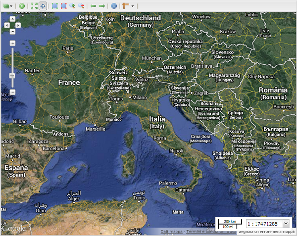

.. module:: mapstore.using.templates.example
   :synopsis: Learn on how to use create a MapStore Template.

.. _mapstore.using.templates.example:

Create your own Template
========================

This section illustrates how you create a custom template for MapStore.

Edit a template
^^^^^^^^^^^^^^^
A template file has been created to create your custom template
Open the following file with a text editor:

``app/templates/custom.html``
  
and add the following javascript 
::

    

save the file and open the web browser at:

    http://localhost:8081/mapcomposer/custom

            Your custom mapstore view.
            

Explanation
^^^^^^^^^^^
first of all, create the base variables for the main application (``app``) and set the ``proxy`` base address to allow cross origin requests::
 

    var app;

    // Proxy 
    var proxy="/http_proxy/proxy?url="; 
    
    

The script in this page creates an instance of ``GeoExplorer.Viewer`` with some basic configuration::
       

        sources: {
            google: {
                ptype: "gxp_googlesource"
            }
        },
        
Add google source to the list of available sources.::

     map:{
        projection: "EPSG:900913",
        units: "m",
        layers: [{
            source: "google",
            title: "Google Hybrid",
            name: "HYBRID",
            group: "background"
        }],
        center: [1250000.000000, 5370000.000000],
        zoom: 5
    },
    
These are the base settings of the map. Google projection, only one layer (Google Hibrid), coordinates of the center and initial zoom level.

.. figure:: img/custom_layer.png

            The Google layer added to the map.
            
::
   
   geoStoreBaseURL:'/geostore/rest/'
    
This is the base url of GeoStore. 