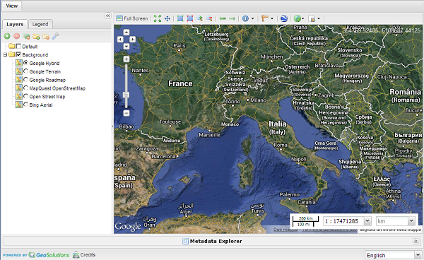
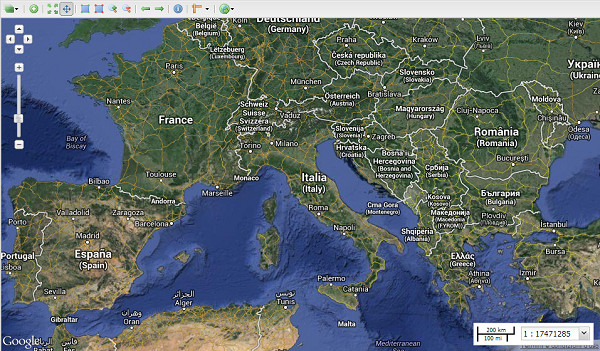

.. module:: mapstore.using.templates.overview
   :synopsis: Learn on how to use The MapStore Templates.

.. _mapstore.using.templates.overview:

Introduction to MapStore Templates
==================================

This section illustrates MapStore's templates.

Templates Overview
^^^^^^^^^^^^^^^^^^^

When you are watching maps on MapStore, your are watching html pages. The MapStore templates are these pages.
You can find all them at:

``<MapStore-Base-Dir>/mapcomposer/app/templates/``

In these pages the whole client application is initializied, and the default configuration is loaded.
``MapStore`` has 2 templates enabled and available:

Composer
^^^^^^^^
http://localhost:8081/mapcomposer/
    

            The Composer.
    
This is the main template used in mapstore. It is a complete interface for viewing and editing maps. 
    
Viewer:
^^^^^^^
http://localhost:8081/mapcomposer/viewer

            The Viewer.

This is minimized graphical user interface, offering the layer selection functionality in a menu to give more space to the map.
This template is typically used for inclusion in a 'simplified iframe or as a viewer.

